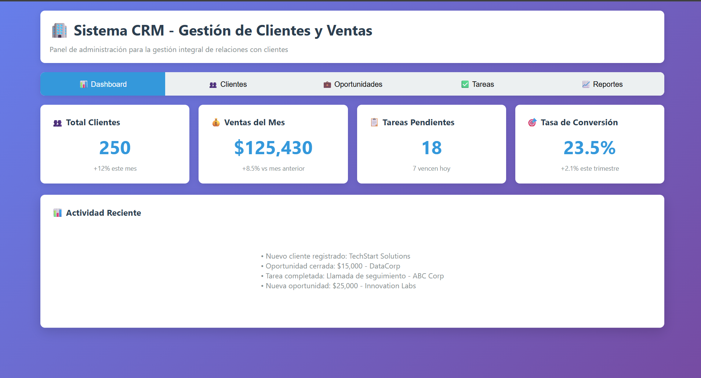
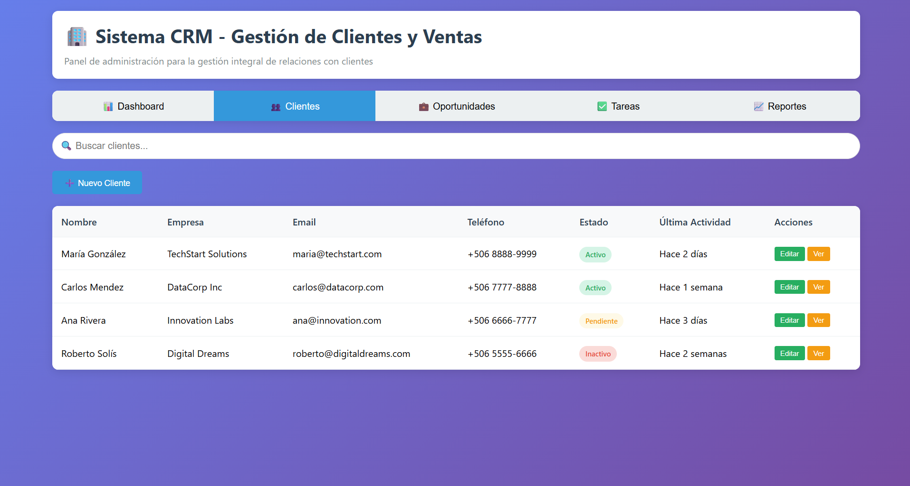
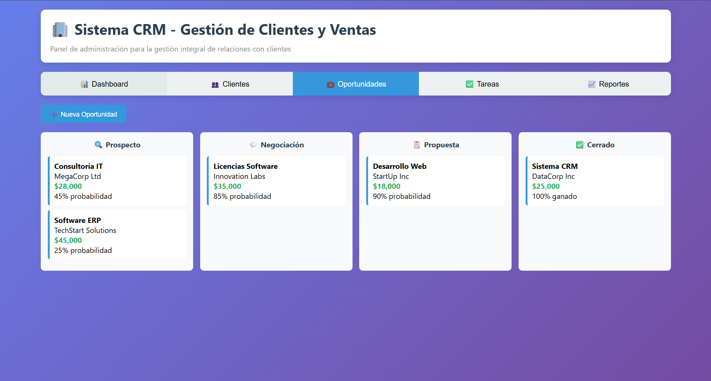
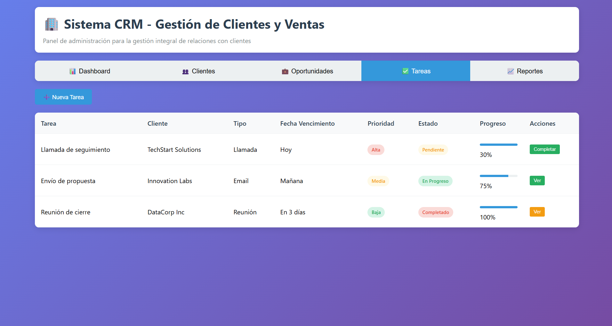

# 🏢 Sistema CRM Web - Gestión de Clientes y Ventas






## 📋 Descripción del Proyecto

Sistema CRM (Customer Relationship Management) desarrollado como proyecto académico para el curso **IC-4810 Administración de Proyectos** del **Instituto Tecnológico de Costa Rica**. Este sistema demuestra la aplicación de metodologías profesionales de gestión de proyectos de TI, abordando la planificación, ejecución parcial y presentación de un sistema funcional de gestión de clientes y ventas.

---

## 🎯 Objetivo Principal

Aplicar los conocimientos adquiridos en administración de proyectos de TI para planificar, ejecutar parcialmente y presentar un proyecto de desarrollo de software, incluyendo la gestión de:

- Riesgos
- Costos
- Recursos
- Cambios

---

## 🚀 Características Principales

### ✨ Funcionalidades Implementadas

- 📊 **Dashboard Ejecutivo** - Métricas clave y KPIs en tiempo real
- 👥 **Gestión de Clientes** - CRUD completo con búsqueda avanzada
- 💼 **Pipeline de Oportunidades** - Vista Kanban con drag & drop
- ✅ **Gestión de Tareas** - Seguimiento de actividades comerciales
- 📈 **Reportes y Análisis** - KPIs y métricas de negocio
- 🔔 **Sistema de Notificaciones** - Feedback visual para acciones del usuario

---

## 🛠️ Tecnologías Utilizadas

- **Frontend:** HTML5, CSS3, JavaScript (ES6+)
- **Diseño:** CSS Grid, Flexbox, Responsive Design
- **Metodología:** Mobile-First, Progressive Enhancement
- **Testing:** Pruebas manuales de funcionalidad

---

## 📱 Capturas de Pantalla

Las imágenes están disponibles en la carpeta [`/assets/screenshots/`](./assets/screenshots/).

---

## 🔧 Instalación y Uso

### Prerrequisitos

- Navegador moderno (Chrome, Firefox, Safari, Edge)
- Editor de código (recomendado: VSCode)

### Instalación Local

```bash
git clone https://github.com/tu-usuario/crm-sistema.git
cd crm-sistema
